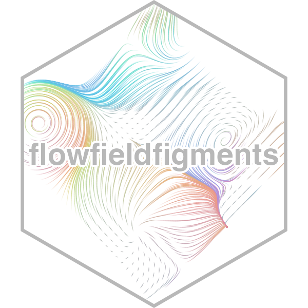

<!-- README.md is generated from README.Rmd. Please edit that file -->

```{r, include = FALSE}
knitr::opts_chunk$set(
  collapse = TRUE,
  comment = "#>",
  fig.path = "man/figures/README-",
  out.width = "100%"
)
```

# flowfieldfigments 

<!-- badges: start -->
<!-- badges: end -->

The `flowfieldsfigments` package creates png and gif files for generative art.

## Installation

You can install the released version of `flowfieldfigments` from [GitHub](https://github.com/) with:

``` r
install.packages("devtools")
devtools::install_github("WilliamTylerBradley/flowfieldfigments")
```

## Articles

See the Articles for information on the generative process. This includes understanding the color scheme creation, the anchor points design, paths determination, a few odds and ends, and a full script that can be easily pulled apart.

## Website

[https://williamtylerbradley.github.io/flowfieldfigments/](https://williamtylerbradley.github.io/flowfieldfigments/)
